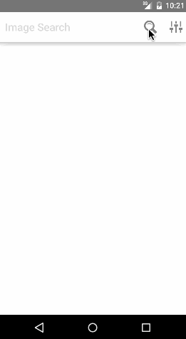

# Android Todo List

This is an Android image search client utilizing the Google Image Search API.

Time spent: ~20 hours spent in total

Checklist (Tasks that are not completed are **IN PROGRESS**):

* [x] User can enter a search query that will display a grid of image results from the Google Image API.
* [x] User can click on "settings" which allows selection of advanced search options to filter results
* [x] User can configure advanced search filters such as Size, Color, Type, Site, and Attribution Rights
* [x] User's subsequent searches will have any filters applied to the search results
* [x] User can tap on any image in results to see the image full-screen
* [x] User can scroll down “infinitely” to continue loading more image results (up to 8 pages)
* [x] Robust error handling, check if internet is available, handle error cases, network failures
* [x] Use the ActionBar SearchView as the query box instead of an EditText
* [x] User can share an image to their friends or email it to themselves
* [x] Filter Settings Activity replaced with a lightweight modal overlay
* [x] Improved user interface utilizing icons, 9 patch images, and transparency
* [x] StaggeredGridView used to improve the grid of image results
* [x] User can zoom or pan images displayed in full-screen detail view

External Libraries Used:
* [Picasso](http://square.github.io/picasso/)
* [PhotoView](https://github.com/chrisbanes/PhotoView)
* [android-async-http](http://loopj.com/android-async-http/)
* [StaggeredGrid](https://github.com/etsy/AndroidStaggeredGrid)
* [BlurDialogFragment](https://github.com/tvbarthel/BlurDialogFragment)

GIF created with [Licecap](http://www.cockos.com/licecap/).